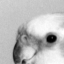
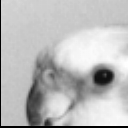

# clairvoyant

clairvoyant is:

- an enhanced version of [The Potato Processor](https://github.com/skordal/potato) with a greyscale image super-resolution accelerator
- my FPGA Ignite 2024 Hackathon project

## In Action

**Original Image**                     | **Enhanced Image**
:-------------------------------------:|:-------------------------------------:
 | 

## Setup

Because the super-resolution functionality uses custom instructions, you need to use [clairvoyant's own custom RISC-V compiler](https://github.com/kagandikmen/clairvoyant-compiler), which is a slightly modified version of the [RISC-V GNU Compiler Toolchain](https://github.com/riscv-collab/riscv-gnu-toolchain).

## Current Status of the Project

Tests on real hardware (AMD Zynq 7020 SoC on PYNQ-Z1) are completed as of 2024-09-01.

### Next Steps

- Function libraries allowing easier access to the super-resolution functionality
- Optimisations in the super-resolution unit (SRU), mainly to make it more generic

## Contributing

Pull requests, suggestions, bug fixes etc. are all welcome.

## License

Both clairvoyant and The Potato Processor are released under BSD-3-Clause license. No copyright infringement intended. See [`LICENSE`](LICENSE) for details.

