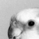
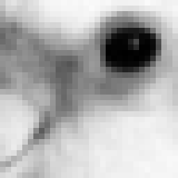
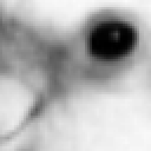
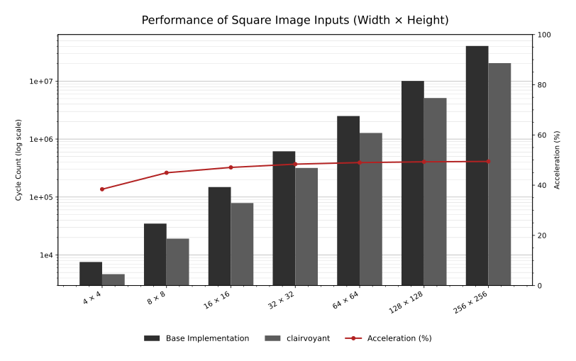
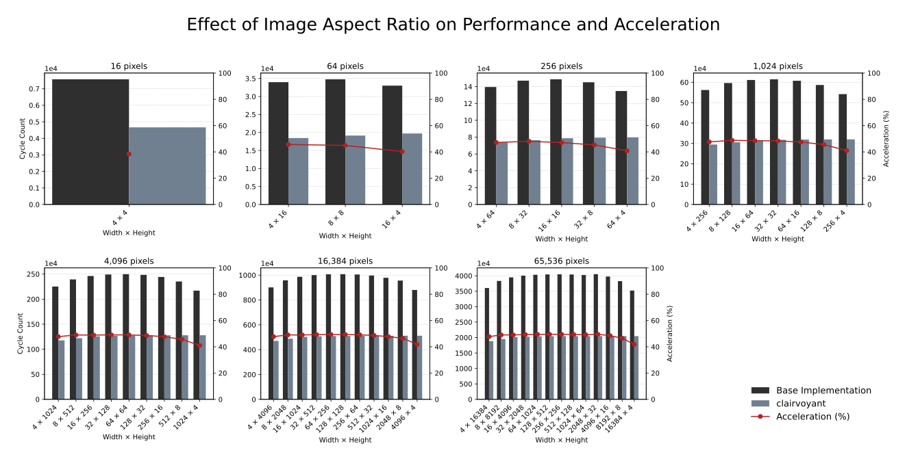
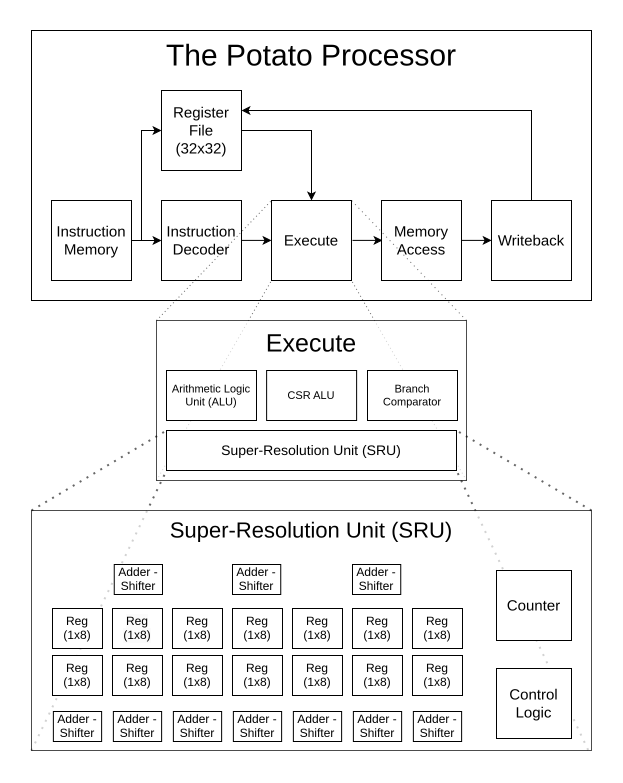

# clairvoyant

*(not capitalized — it knows better than that)*

**clairvoyant** is a RISC-V SoC extended with a custom 2× image upscaling accelerator that uses a hybrid nearest-neighbor and bilinear interpolation scheme. It is based on [The Potato Processor](https://github.com/skordal/potato).

This repository includes:

- A synthesizable hardware design of clairvoyant including its upscaling accelerator, SRU
- A demo application showcasing how to develop software using the in-hardware image super-resolution functionality
- Instructions and constraint files to build and run it on Xilinx ARTY A7 and PYNQ-Z1 FPGA boards
- Example results, performance measurements, and documentation

## In Action

**Original Image**                     | **Image Enhanced w/ clairvoyant**
:-------------------------------------:|:-------------------------------------:
    | 

### Closer Look*

**Original Image** | **Image Enhanced w/ clairvoyant**
:-------------------------------:|:-----------------------------------:
 | 

\
\* Both images are cropped and resized with ImageMagick for a closer inspection of the results. ImageMagick was run with `-filter box` option for demonstration purposes. Otherwise, it uses its own image enhancement algorithm during resizing, which delivers a similar result to clairvoyant's but is purely software-based.

## Performance



**Figure 1:** Plot displaying how performance (in cycle counts) and acceleration (in percentage) offered by clairvoyant's in-hardware image super-resolution change for different image sizes. The enhanced images are all square and grayscale. For a simple 4×4 image, clairvoyant offers 38.4% acceleration over the base software implementation. As the image size increases, clairvoyant achieves up to 49.4% acceleration.



**Figure 2:** Plot displaying how performance (in cycle counts) and acceleration (in percentage) offered by clairvoyant's in-hardware image super-resolution change for different image aspect ratios for any given image size. The enhanced images are all square and grayscale.

## Architecture



## Setup

Because the super-resolution functionality uses custom instructions, you need to use [clairvoyant's own custom RISC-V compiler](https://github.com/kagandikmen/clairvoyant-compiler), which is a slightly modified version of the [RISC-V GNU Compiler Toolchain](https://github.com/riscv-collab/riscv-gnu-toolchain).

## Tests

You need to have Vivado installed on your machine to run the tests. There are also two standard packages needed. On Ubuntu, execute the following command before running the tests:

```bash
sudo apt install libncurses5 libtinfo5
```

Then you can continue with running the test using:

```bash
make
```

At the end, you can remove the generated test files by a simple:

```bash
make clean
```

## Current Status of the Project

Tests on real hardware (AMD Zynq 7020 SoC on PYNQ-Z1) are completed as of 2025-05-14. The demo application in [software/sr_demo/](software/sr_demo/) can successfully enhance grayscale images with sizes up to 256×256.

### Next Steps

- Measurement and documentation of clairvoyant's PSNR
- Python code to generate the plots in [docs/cv/eval/](docs/cv/eval/)
- Implementation of RGB superresolution in a dedicated demo application
- Function libraries to facilitate access to the super-resolution functionality
- README file for the demo

## Contributing

Pull requests, suggestions, bug fixes etc. are all welcome.

## License

Both clairvoyant and [The Potato Processor](https://github.com/skordal/potato) are released under BSD-3-Clause license. See [`LICENSE`](LICENSE) for details.

