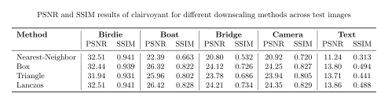

# clairvoyant

*(not capitalized — it knows better than that)*

**clairvoyant** is a RISC-V SoC extended with a custom bilinear image upscaling accelerator. It is based on [The Potato Processor](https://github.com/skordal/potato).

This repository includes:

- A synthesizable hardware design of clairvoyant including its upscaling accelerator, SRU
- A demo application showcasing how to develop software using the in-hardware image super-resolution functionality
- Instructions and constraint files to build and run it on Xilinx ARTY A7 and PYNQ-Z1 FPGA boards
- Example results, performance measurements, and documentation

## In Action

**Original Image**                     | **Image Enhanced w/ clairvoyant**
:-------------------------------------:|:-------------------------------------:
    | 

### Closer Look*

**Original Image** | **Image Enhanced w/ clairvoyant**
:-------------------------------:|:-----------------------------------:
 | 

\
\* Both images are cropped and resized using ImageMagick for a closer inspection of the results. ImageMagick was run with `-filter Point` option for demonstration purposes, where it runs a simple nearest-neighbor resizing algorithm.

## Performance


**Figure 1:** Plot displaying how performance (in cycle counts) and acceleration (in percentage) offered by clairvoyant's in-hardware image super-resolution change for different image sizes. The enhanced images are all square and grayscale. For a simple 4×4 image, clairvoyant offers 38.4% acceleration over the base software implementation. As the image size increases, clairvoyant achieves up to 49.4% acceleration.


**Figure 2:** Plot displaying how performance (in cycle counts) and acceleration (in percentage) offered by clairvoyant's in-hardware image super-resolution change for different image aspect ratios for any given image size. The enhanced images are all square and grayscale.

## Regeneration Quality

To evaluate the quality of clairvoyant's image upscaling functionality, a standard degradation-restoration process is used. This technique involves downscaling the original picture to half its dimensions, and then upscaling it back using the upscaling algorithm being evaluated. The final result is then compared with the original.

The PSNR (Peak Signal-to-Noise Ratio) and SSIM (Structural Similarity Index Measure) metrics of this evaluation, for different test images and downscaling techniques, are as follows for clairvoyant:



## Architecture


## Setup

Because the super-resolution functionality uses custom instructions, you need to use [clairvoyant-compiler](https://github.com/kagandikmen/clairvoyant-compiler), which is a slightly modified version of the [RISC-V GNU Compiler Toolchain](https://github.com/riscv-collab/riscv-gnu-toolchain). To install clairvoyant-compiler on your host machine, please refer to [clairvoyant-compiler/README.md](https://github.com/kagandikmen/clairvoyant-compiler/blob/master/README.md).

## Tests

GHDL needs to be installed on the host machine to run the unit tests for clairvoyant. Install GHDL by running:
```bash
sudo apt install ghdl
```
Then you can continue with running the unit tests using:
```bash
make
```
You can remove the test build and the runtime files by a simple:
```bash
make clean
```

The unit tests can also be performed using Vivado. To download Vivado, please see AMD's [Downloads](https://www.xilinx.com/support/download.html) portal for Vivado Design Suite. To run the unit tests using Vivado, libraries `libncurses5` and `libtinfo5` are also required, which can be installed through:
```bash
sudo apt install libncurses5 libtinfo5
```
Then you can continue by running:
```bash
make vivado
```
to execute the tests.

## Current Status of the Project

Tests on real hardware (AMD Zynq 7020 SoC on PYNQ-Z1) are completed as of 2025-05-14. The demo application in [software/sr_demo/](software/sr_demo/) can successfully enhance grayscale images with sizes up to 256×256.

### Next Steps

- Python code to generate the plots in [docs/cv/eval/](docs/cv/eval/)
- Implementation of RGB superresolution in a dedicated demo application
- Function libraries to facilitate access to the super-resolution functionality
- README file for the demo

## Contributing

Pull requests, suggestions, bug fixes etc. are all welcome.

## License

Both clairvoyant and [The Potato Processor](https://github.com/skordal/potato) are released under BSD-3-Clause license. See [`LICENSE`](LICENSE) for details.

